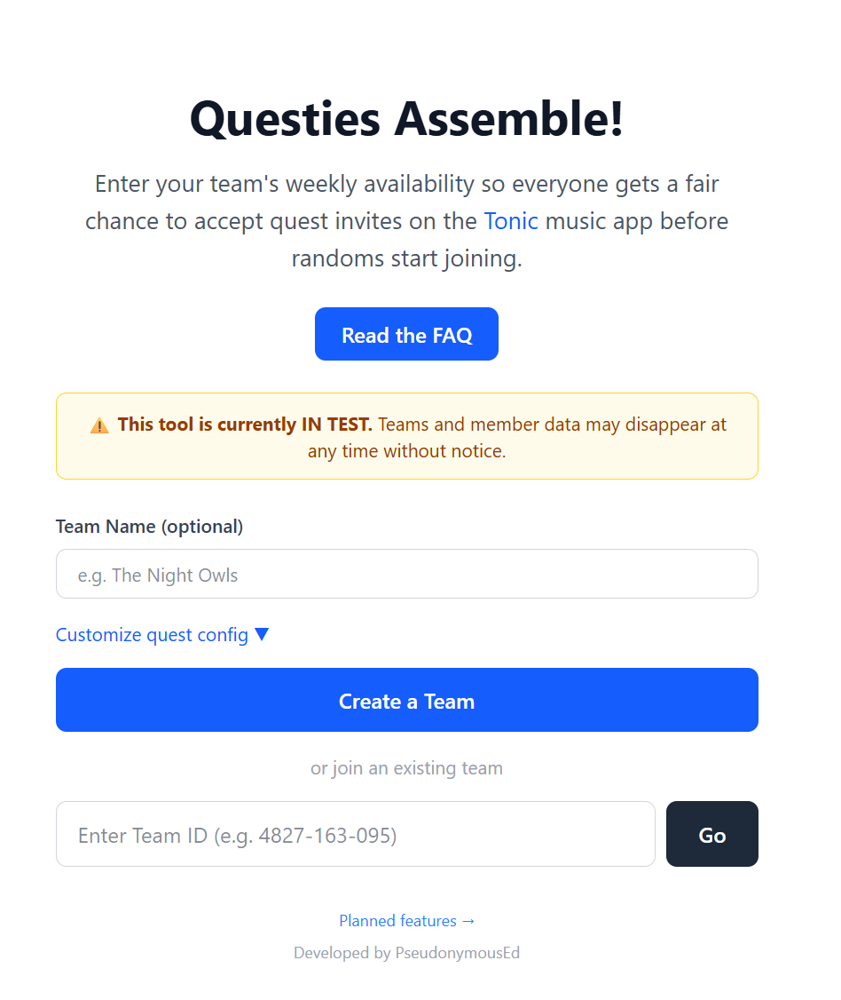
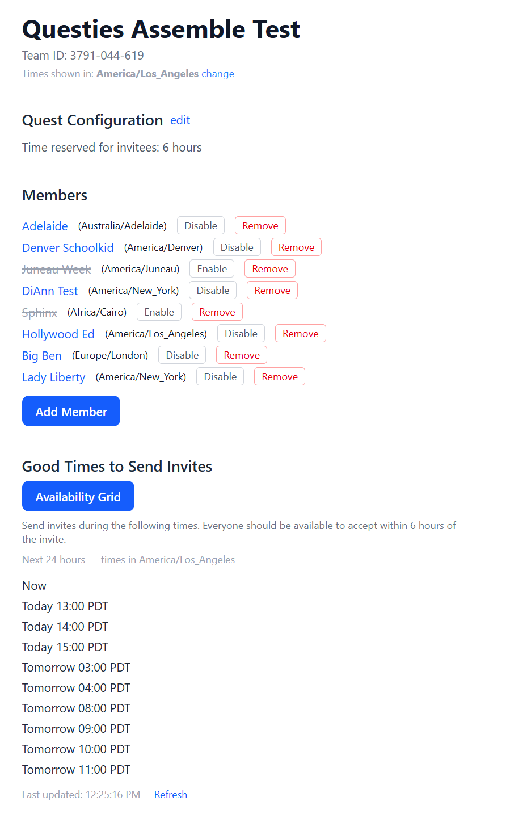
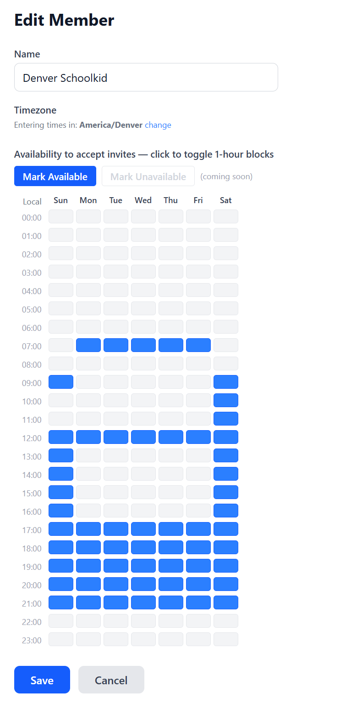
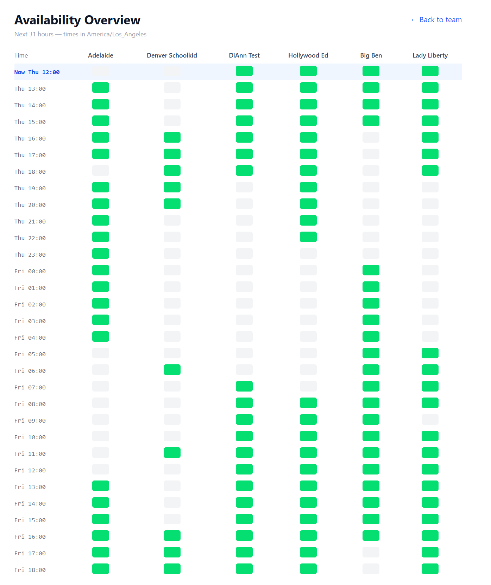

# Questies Assemble!

A scheduling tool to help users coordinate quest teams on the [Tonic](https://www.jointonic.com/) music app.

Quest invites on Tonic have a limited acceptance window, and filling a team before randoms start joining requires members to be online and ready at the right time. Questies Assemble! lets teams share their weekly availability so everyone can see the best times to send invites — times when all members are likely to be around to accept.

This project was written with the assistance of [Claude](https://claude.ai) (Anthropic).

## Screenshots

<table>
  <tr>
    <td></td>
    <td></td>
    <td></td>
    <td></td>
  </tr>
  <tr>
    <td align="center">Home</td>
    <td align="center">Team</td>
    <td align="center">Member</td>
    <td align="center">Availability Grid</td>
  </tr>
</table>

## Features

- Create a team with a shareable 10-digit ID
- Add members and set their weekly availability by timezone
- Automatically calculates the best invite send times for the next 24 hours
- Configurable invite window duration

## Tech Stack

| Layer | Technology |
|---|---|
| UI Framework | React 18 + Vite |
| Styling | Tailwind CSS |
| Routing | React Router v6 |
| Database / API | Supabase (Postgres) |
| Hosting | Vercel |
| Timezone handling | Luxon |

## Local Development

1. Copy `.env.example` to `.env.local` and fill in your Supabase project URL and anon key
2. Install dependencies: `npm install`
3. Start the dev server: `npm run dev`

## Project Structure

```
src/
├── components/
│   ├── AvailabilityGrid.jsx   # Weekly availability toggle grid
│   ├── NavBar.jsx             # Site-wide navigation bar
│   ├── ResultsList.jsx        # Good invite times display
│   └── TimezoneSelector.jsx   # Timezone search and select
├── pages/
│   ├── AvailabilityComparison.jsx  # Grid comparing all members' availability
│   ├── ComingFeatures.jsx          # Planned features page
│   ├── Faq.jsx                     # FAQ page
│   ├── Home.jsx                    # Home / team creation page
│   ├── MemberEdit.jsx              # Add or edit a team member
│   ├── NotFound.jsx                # 404 page
│   └── Team.jsx                    # Team overview and invite times
├── utils/
│   ├── scheduler.js           # Good invite time calculation
│   └── timezone.js            # Local ↔ UTC slot conversion
└── lib/
    └── supabase.js            # Supabase client
docs/
├── brainstorm/      # Early planning notes and FAQ drafts
├── plan/            # Original implementation plan
├── phases/          # Per-phase change logs
└── scripts/         # SQL utility scripts
images/              # Screenshots used in this README
```
